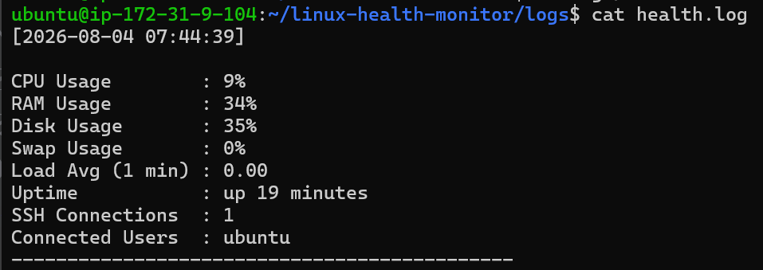

# Linux Health Monitor

   


A lightweight, dependency-free Bash script that checks the vital signs of
a Linux server — CPU, RAM, disk, swap, load, uptime, and connected users
— and logs the results to a file.


---

## Overview

This project is a beginner-friendly introduction to Linux system
monitoring and Bash scripting. Everything lives in a single,
well-commented script, making it easy to read from start to finish and
understand exactly what each line does.

## Features

| Metric                 | How it's measured                          |
|-------------------------|--------------------------------------------|
| CPU usage               | `top -bn1` (100 − idle %)                   |
| RAM usage                | `free` (used / total memory)                |
| Disk usage               | `df /` (Use% of root filesystem)            |
| Swap usage               | `free` (used / total swap)                  |
| Load average (1 min)     | `uptime`                                    |
| System uptime            | `uptime -p`                                 |
| SSH connections / users  | `ss` + `ps` (active sessions & usernames)   |

The script measures and records each of these metrics as a plain,
readable snapshot of system health.

## Project Structure

```
linux-health-monitor/
├── health-monitor.sh    # the one and only script — run this
├── logs/
│   └── health.log       # every run appends one entry here
└── README.md
```

## Prerequisites

- **A Linux machine or VM** — tested on Ubuntu Server (any modern
  Debian/Ubuntu-based distro works the same way).
- **Terminal / SSH access** to that machine, with a regular user account
  (root is not required).
- **Bash** — pre-installed on virtually every Linux distro; check with
  `bash --version`.
- **Standard core-utils** — `top`, `free`, `df`, `uptime`, `ss`, `ps`.
  These ship by default on Ubuntu/Debian; check any one is present with,
  e.g., `which ss`.
- **Git** — to clone this repository.

## Installation & Usage

```bash
# 1. Clone the repository
git clone https://github.com/<your-username>/linux-health-monitor.git

# 2. Move into the project folder
cd linux-health-monitor

# 3. Make the script executable (only needed once)
chmod +x health-monitor.sh

# 4. Run a health check
./health-monitor.sh
```

Each run prints a short summary to the screen:

```
Health check complete.
Full details logged to: /home/ubuntu/linux-health-monitor/logs/health.log
```

...and appends a full entry to `logs/health.log`:

```
[2026-08-04 07:30:04]

CPU Usage        : 0%
RAM Usage        : 35%
Disk Usage       : 35%
Swap Usage       : 0%
Load Avg (1 min) : 0.02
Uptime           : up 4 minutes
SSH Connections  : 1
Connected Users  : ubuntu
---------------------------------------------
```



Logs are never overwritten — `logs/health.log` grows with every run,
providing a running history of health checks over time.

## License

This project is available under the MIT License — free to use, modify,
and share.
