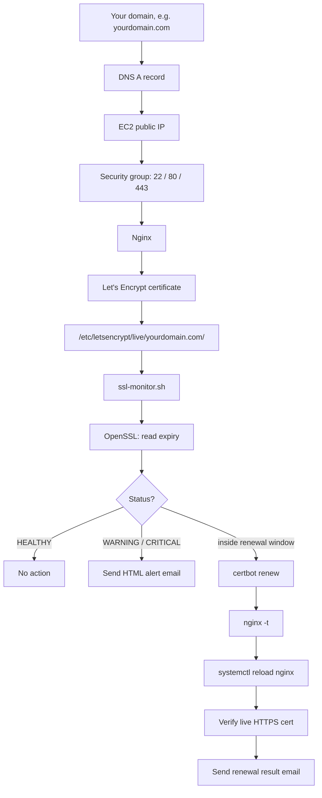

# SSL Certificate Monitoring System

A complete, start-to-finish guide to standing up an Ubuntu EC2 server, serving a site over Nginx, securing it with a free Let's Encrypt certificate, and deploying this project to monitor that certificate's expiry, alert by HTML email, and drive its renewal automatically.

[](https://www.gnu.org/software/bash/)
[](https://nginx.org/)
[](https://certbot.eff.org/)
[](https://aws.amazon.com/ec2/)
[](LICENSE)

This README assumes **nothing is set up yet** — no server, no domain, no certificate — and walks through every step in the order you'd actually do them. If you already have a server running Nginx behind a Let's Encrypt certificate, skip ahead to [Phase 11](#phase-11--deploy-the-ssl-monitoring-system).

---

## Table of Contents

- [Architecture](#architecture)
- [What you'll need](#what-youll-need)
- [Phase 1 — Launch the EC2 instance](#phase-1--launch-the-ec2-instance)
- [Phase 2 — Connect to the instance via SSH](#phase-2--connect-to-the-instance-via-ssh)
- [Phase 3 — Update the server](#phase-3--update-the-server)
- [Phase 4 — Install Nginx](#phase-4--install-nginx)
- [Phase 5 — Install the mail stack and project dependencies](#phase-5--install-the-mail-stack-and-project-dependencies)
- [Phase 6 — Point your domain at the server](#phase-6--point-your-domain-at-the-server)
- [Phase 7 — Confirm the site over HTTP (checkpoint)](#phase-7--confirm-the-site-over-http-checkpoint)
- [Phase 8 — Issue the Let's Encrypt certificate](#phase-8--issue-the-lets-encrypt-certificate)
- [Phase 9 — Verify HTTPS](#phase-9--verify-https)
- [Phase 10 — Configure Postfix to relay mail through Gmail](#phase-10--configure-postfix-to-relay-mail-through-gmail)
- [Phase 11 — Deploy the SSL Monitoring System](#phase-11--deploy-the-ssl-monitoring-system)
- [Phase 12 — Run and test the monitor](#phase-12--run-and-test-the-monitor)
- [Phase 13 — Automate with cron](#phase-13--automate-with-cron)
- [Configuration reference](#configuration-reference)
- [Email notifications](#email-notifications)
- [Troubleshooting](#troubleshooting)
- [Roadmap](#roadmap)
- [License](#license)

---

## Architecture



---

## What you'll need

- An AWS account with permission to launch EC2 instances
- A domain name you control (any registrar — GoDaddy is used as the example here, but Route 53, Namecheap, Cloudflare, etc. all work the same way)
- A Gmail account with an **app password** generated (for relaying alert email — never use your real Gmail password)
- A terminal on your own machine (macOS/Linux Terminal, or Windows Terminal / WSL / PuTTY)

---

## Phase 1 — Launch the EC2 instance

1. Sign in to the **AWS Console** and open **EC2 → Instances**.
2. Click **Launch instance**.
3. Configure the instance:

   | Setting | Value |
   |---|---|
   | **Name** | `ssl-monitor` (or any name you like) |
   | **AMI** | Ubuntu Server (latest LTS) |
   | **Instance type** | `t2.micro` or `t3.micro` — sufficient for this project |
   | **Key pair** | Create a new key pair (e.g. `ssl-monitor-key`), type `.pem`, and **download it** — you cannot re-download it later |
   | **Storage** | 8 GiB gp3 (the default is enough) |
   | **Security group** | Create a new one allowing the three rules below |

4. Configure the **security group** inbound rules:

   | Type | Protocol | Port | Source | Purpose |
   |---|---|---|---|---|
   | SSH | TCP | 22 | My IP (recommended) or 0.0.0.0/0 | Server administration |
   | HTTP | TCP | 80 | 0.0.0.0/0 | ACME HTTP-01 challenge + HTTP→HTTPS redirect |
   | HTTPS | TCP | 443 | 0.0.0.0/0 | Encrypted site traffic |

📸 **Screenshot 1 — Launch configuration summary.** Before clicking Launch, capture the review screen showing the name, Ubuntu AMI, instance type, the key pair, 8 GiB storage, and the security group with SSH/HTTP/HTTPS all listed.

<p align="center">
  
</p>

5. Click **Launch instance**, then open the instance and wait for:
   - **Instance state:** `Running`
   - **Status check:** `2/2 checks passed`

📸 **Screenshot 2 — Instance up and running.** Capture the EC2 instances list (or the instance's Details tab) showing the running state, the status checks passed, and the **Public IPv4 address**.

<p align="center">
  
</p>

---

## Phase 2 — Connect to the instance via SSH

1. Select the instance in the console and click **Connect**.
2. Open the **SSH client** tab — it shows the exact command to use, built from your key pair and the instance's public DNS name.

📸 **Screenshot 3 — Connect dialog.** Capture the "Connect to instance" screen with the SSH client tab open, showing the ready-made `ssh -i "..." ubuntu@...` command.

<p align="center">
  
</p>

3. On your own machine, open a terminal and go to the folder where the `.pem` file downloaded — usually **Downloads**:

   ```bash
   cd ~/Downloads
   ls -l *.pem
   ```

📸 **Screenshot 4 — Locating the key.** Capture the terminal after `cd ~/Downloads` and `ls`, showing the `.pem` file present.

<p align="center">
  
</p>

4. Lock down the key's permissions (required on macOS/Linux — SSH refuses to use a key that's readable by others):

   ```bash
   chmod 400 ssl-monitor-key.pem
   ```

5. Paste the command copied from the Connect dialog and run it, substituting your own key filename and public IP/DNS:

   ```bash
   ssh -i "ssl-monitor-key.pem" ubuntu@YOUR_PUBLIC_IP
   ```

   Type `yes` if prompted to trust the host's fingerprint.

📸 **Screenshot 5 — Connected.** Capture the terminal once you land at the Ubuntu prompt, e.g. `ubuntu@ip-172-31-x-x:~$`.

<p align="center">
  
</p>

---

## Phase 3 — Update the server

Always start a fresh instance with an update, before installing anything:

```bash
sudo apt update
sudo apt upgrade -y
```

Verify the OS if you like:

```bash
cat /etc/os-release
```

---

## Phase 4 — Install Nginx

```bash
sudo apt install nginx -y
sudo systemctl enable nginx
sudo systemctl status nginx
```

You want to see `Active: active (running)`. Press `q` to exit the status view.

Now open `http://YOUR_PUBLIC_IP` in a browser — you should see the default Nginx welcome page. This is an important checkpoint: if this doesn't load, fix it here before touching DNS or HTTPS.

📸 **Screenshot 6 — Default Nginx page.** Capture the browser showing the stock "Welcome to nginx!" page at your instance's public IP.

<p align="center">
  
</p>

Put your own site content in place and remove the placeholder:

```bash
sudo vim /var/www/html/index.html      # paste your site's HTML
sudo rm -f /var/www/html/index.nginx-debian.html

sudo chown -R www-data:www-data /var/www/html
sudo find /var/www/html -type d -exec chmod 755 {} \;
sudo find /var/www/html -type f -exec chmod 644 {} \;
```

Reload the IP in your browser (hard refresh with `Ctrl+Shift+R` if you still see the old page) to confirm your own content is now served.

---

## Phase 5 — Install the mail stack and project dependencies

Install everything the SSL monitor needs in one pass — the web server dependency (OpenSSL, usually already present), the certificate tool, and the full mail-sending stack:

```bash
# Mail stack: Postfix (MTA), SASL auth modules, CA certs, and mail-sending utilities
sudo apt install postfix libsasl2-modules ca-certificates mailutils -y
```

When the Postfix installer prompts you, choose **Internet Site** and set the system mail name to your domain.

```bash
# Certbot, via Snap (the officially recommended install method)
sudo apt install snapd -y
sudo snap install core
sudo snap refresh core
sudo snap install --classic certbot
sudo ln -s /snap/bin/certbot /usr/bin/certbot
certbot --version

# Confirm OpenSSL is already present (it ships with Ubuntu — don't reinstall blindly)
openssl version

# Git, to pull this repository
sudo apt install git -y
```

| Package | Why it's needed |
|---|---|
| `nginx` | Serves the site and terminates TLS |
| `postfix` | Local mail transfer agent — relays the monitor's alert emails |
| `libsasl2-modules` | Lets Postfix authenticate to an external SMTP server (Gmail) |
| `ca-certificates` | Trusted root certificates, needed for Postfix's TLS connection to Gmail |
| `mailutils` | Provides the `mail` command used to send test messages |
| `certbot` | Requests and renews the Let's Encrypt certificate |
| `openssl` | Reads certificate expiry/issuer/subject — this project's monitoring engine |
| `git` | Clones this repository onto the server |

---

## Phase 6 — Point your domain at the server

1. Buy or use an existing domain at any registrar (GoDaddy is used here as the example).
2. Open **DNS Management** for the domain and add an **A record**:

   | Type | Name | Value | TTL |
   |---|---|---|---|
   | A | `@` | Your EC2 public IPv4 address | Default / 1 hour |

📸 **Screenshot 7 — DNS A record.** Capture the DNS management screen showing the A record pointed at your EC2 public IP.

<p align="center">
  
</p>

3. DNS changes can take anywhere from a few minutes to a few hours to propagate. Check from the server:

   ```bash
   getent hosts yourdomain.com
   ping -c 1 yourdomain.com
   ```

   Both should resolve to your EC2 public IP before you continue.

---

## Phase 7 — Confirm the site over HTTP (checkpoint)

```bash
curl -I http://yourdomain.com
```

Expect `HTTP/1.1 200 OK`. Then open `http://yourdomain.com` in a browser and confirm you see your site.

📸 **Screenshot 8 — Domain resolving over HTTP.** Capture the browser at `http://yourdomain.com` showing your site (not yet secured).

<p align="center">
  
</p>

Validate the Nginx config before moving on:

```bash
sudo nginx -t
sudo systemctl reload nginx
```

---

## Phase 8 — Issue the Let's Encrypt certificate

Only once HTTP is confirmed working should you request a certificate:

```bash
sudo certbot --nginx -d yourdomain.com
```

Certbot will ask for an email address, ask you to accept the terms, and ask whether to redirect HTTP to HTTPS — choose **yes, redirect**. It then contacts Let's Encrypt, validates domain ownership, obtains the certificate, and edits the Nginx config for you.

📸 **Screenshot 9 — Certbot issuing the certificate.** Capture the terminal output of a successful `certbot --nginx` run.

<p align="center">
  
</p>

Confirm it's on disk:

```bash
sudo certbot certificates
sudo openssl x509 -in /etc/letsencrypt/live/yourdomain.com/fullchain.pem -noout -dates -issuer -subject
```

---

## Phase 9 — Verify HTTPS

Open `https://yourdomain.com` in a browser — you should see a padlock and your site.

📸 **Screenshot 10 — HTTPS working.** Capture the browser at `https://yourdomain.com` with the padlock visible.

<p align="center">
  
</p>

📸 **Screenshot 11 — Certificate details.** Click the padlock → certificate details, and capture the issuer (Let's Encrypt) and validity dates.

<p align="center">
  
</p>

Confirm the redirect and the live certificate from the server side too:

```bash
curl -I http://yourdomain.com          # expect a 301 to https://

echo | openssl s_client -connect yourdomain.com:443 -servername yourdomain.com 2>/dev/null \
  | openssl x509 -noout -dates -issuer -subject

sudo certbot renew --dry-run           # simulates renewal without touching the live cert
```

A successful dry run prints `Congratulations, all simulated renewals succeeded` — nothing is actually replaced.

---

## Phase 10 — Configure Postfix to relay mail through Gmail

The monitor sends mail via the local `sendmail` binary; Postfix needs to relay it out through a real SMTP provider.

```bash
sudo postconf -e 'myhostname = yourdomain.com'
sudo postconf -e 'mydomain = yourdomain.com'
sudo postconf -e 'myorigin = $mydomain'
sudo postconf -e 'relayhost = [smtp.gmail.com]:587'
sudo postconf -e 'smtp_sasl_auth_enable = yes'
sudo postconf -e 'smtp_sasl_password_maps = hash:/etc/postfix/sasl_passwd'
sudo postconf -e 'smtp_sasl_security_options = noanonymous'
sudo postconf -e 'smtp_tls_security_level = encrypt'
sudo postconf -e 'smtp_tls_CAfile = /etc/ssl/certs/ca-certificates.crt'
sudo postconf -e 'inet_interfaces = loopback-only'
sudo postconf -e 'mynetworks = 127.0.0.0/8'
```

Store your Gmail **app password** (not your normal password) in the SASL credential file:

```bash
sudo vim /etc/postfix/sasl_passwd
# add one line:
# [smtp.gmail.com]:587    your-account@gmail.com:your-16-char-app-password

sudo chmod 600 /etc/postfix/sasl_passwd
sudo postmap /etc/postfix/sasl_passwd
sudo systemctl restart postfix
```

Send a test email to confirm delivery before wiring it into the monitor:

```bash
echo "SSL Monitor Postfix test" | mail -s "SSL Monitor Test" you@example.com
sudo tail -f /var/log/mail.log
# look for: status=sent (250 2.0.0 OK ...)
```

---

## Phase 11 — Deploy the SSL Monitoring System

```bash
cd ~
git clone https://github.com/Deepak8260/SSL-Monitoring-System.git
cd SSL-Monitoring-System
chmod +x bin/*.sh
```

Project layout:

```
SSL-Monitoring-System/
├── bin/
│   ├── ssl-monitor.sh        # Main controller — run this from cron
│   ├── certificate.sh        # Reads the cert with OpenSSL, computes status
│   ├── email.sh               # Renders templates and sends HTML mail
│   ├── renewal.sh             # Drives Certbot, Nginx reload, verification
│   ├── verification.sh        # Confirms the live HTTPS cert after renewal
│   └── test-email.sh          # Sends a sample of any one template on demand
├── config/
│   ├── ssl-monitor.conf       # Domain, thresholds, demo mode, log path
│   └── email.conf             # SMTP identity and alert recipient (chmod 600)
├── templates/                 # One HTML template per status/event
└── logs/
    └── ssl-monitor.log
```

Edit the two config files:

```bash
vim config/ssl-monitor.conf
vim config/email.conf
chmod 600 config/email.conf
```

See [Configuration reference](#configuration-reference) below for every key.

---

## Phase 12 — Run and test the monitor

```bash
cd bin
sudo ./ssl-monitor.sh
```

📸 **Screenshot 12 — A healthy monitor run.** Capture the terminal output of a normal run reporting `HEALTHY`.

<p align="center">
  
</p>

Send a sample of each template to check the visual design in your inbox:

```bash
sudo ./test-email.sh healthy
sudo ./test-email.sh warning
sudo ./test-email.sh critical
sudo ./test-email.sh expired
sudo ./test-email.sh renewal-success
```

📸 **Screenshot 13 — Sample alert emails.** Capture a couple of the received emails side by side.

<p align="center">
  
  
</p>

To see the full renewal path (Certbot → `nginx -t` → reload → live verification), set `DEMO_MODE=true` and a low `DEMO_REMAINING_DAYS` in `config/ssl-monitor.conf`, then run the monitor again:

📸 **Screenshot 14 — Renewal workflow.** Capture the terminal output of a full renewal cycle completing successfully.

<p align="center">
  
</p>

---

## Phase 13 — Automate with cron

```bash
sudo crontab -e
```

Add a single line — **hourly**, never every minute (see [Troubleshooting](#troubleshooting) for why):

```
0 * * * * /home/ubuntu/SSL-Monitoring-System/bin/ssl-monitor.sh >> /home/ubuntu/SSL-Monitoring-System/logs/cron.log 2>&1
```

📸 **Screenshot 15 — Cron schedule confirmed.**

<p align="center">
  
</p>

---

## Configuration reference

**`config/ssl-monitor.conf`**

| Key | Meaning |
|---|---|
| `DOMAIN` | The domain the certificate belongs to |
| `CERTIFICATE` | Absolute path to `fullchain.pem` |
| `WARNING_DAYS` | Days remaining that triggers `WARNING` (default 30) |
| `CRITICAL_DAYS` | Days remaining that triggers `CRITICAL` (default 7) |
| `RENEWAL_DAYS` | Days remaining that triggers a renewal attempt (default 30) |
| `LOG_FILE` | Absolute path for the run log |
| `DEMO_MODE` | `true` simulates expiry and runs `certbot renew --dry-run`; set `false` in production |
| `DEMO_REMAINING_DAYS` | Fake remaining-day count used only in demo mode |

**`config/email.conf`**

| Key | Meaning |
|---|---|
| `EMAIL_FROM` | Sending mailbox |
| `EMAIL_FROM_NAME` | Display name recipients see |
| `ALERT_EMAIL` | Address that receives alerts |
| `EMAIL_ON_HEALTHY` | `false` recommended in production; `true` only for demos |

> Keep `config/email.conf` at `chmod 600` and out of version control — it is effectively a credential file.

---

## Email notifications

| Status / event | Template | Subject |
|---|---|---|
| HEALTHY | `healthy.html` | SSL Certificate Healthy - {domain} |
| WARNING | `warning.html` | SSL Certificate Warning - {domain} |
| CRITICAL | `critical.html` | URGENT: SSL Certificate Critical - {domain} |
| EXPIRED | `expired.html` | URGENT: SSL Certificate Expired - {domain} |
| Renewal succeeded | `renewal-success.html` | SSL Certificate Renewal Successful - {domain} |
| Renewal succeeded (demo) | `renewal-simulation-success.html` | SSL Renewal Simulation Successful - {domain} |
| Renewal failed | `renewal-failure.html` | URGENT: SSL Certificate Renewal Failed - {domain} |

Exit codes from `ssl-monitor.sh`: `0` HEALTHY · `1` WARNING · `2` CRITICAL · `3` EXPIRED · `4` configuration/environment error.

---

## Troubleshooting

- **Browser can't reach the public IP at all** — check the security group has ports 80/443 open, and that the instance passed both status checks.
- **`Permission denied (publickey)` on SSH** — confirm `chmod 400` was run on the `.pem` file, and that you're using the `ubuntu` user, not `root` or `ec2-user`.
- **`ERROR: Configuration file not found`** — `ssl-monitor.sh` resolves its config path from its own script location; make sure you're running it from inside the cloned repo, and that the path in `CONFIG_FILE` (if hardcoded) matches where you actually cloned the project.
- **`Another instance of Certbot is already running`** — caused by scheduling the monitor more often than one Certbot run takes to finish (e.g. every minute). Use the hourly cron schedule from Phase 13.
- **`Permission denied` reading the certificate** — always run the scripts with `sudo`; the Let's Encrypt directory is root-owned.
- **No renewal email after a CRITICAL email** — the CRITICAL/WARNING email and the renewal email are sent by two different code paths; a renewal email only fires if the Certbot → `nginx -t` → reload → verification chain fully succeeds.
- **Postfix test mail never arrives** — check `sudo tail -f /var/log/mail.log` for the actual SMTP response; a `Network is unreachable` line usually means outbound port 587 is blocked somewhere upstream of the instance.

---

## Roadmap

- [ ] Replace any hardcoded config path in `ssl-monitor.sh` with one derived from the script's own location
- [ ] Add a `state/` directory to suppress duplicate alerts on unchanged status
- [ ] Migrate from crontab to a `systemd` service + timer pair
- [ ] Set `DEMO_MODE=false` and `EMAIL_ON_HEALTHY=false` as the committed defaults

---

## License

MIT — see [`LICENSE`](LICENSE).