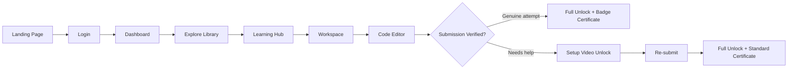

# ProjectPro (BuildSpace)

<p align="center">
  
  
  
  
</p>

## Overview

BuildSpace is a project-based learning platform built around a single principle:

> **"Coding is the last step of engineering."**

Rather than giving students a video tutorial on day one, BuildSpace requires them to first understand a project's architecture, then attempt to build it with AI assistance, and only unlocks full learning resources after a genuine attempt has been verified. The result is active, hands-on learning instead of passive video consumption.

This document describes the end-to-end student experience and the system logic behind it, for reference by anyone contributing to this repository.

## Table of Contents

- [Overview](#overview)
- [Student Flow](#student-flow)
- [Learning Hub](#learning-hub)
- [Workspace](#workspace)
- [AI Agent Behavior](#ai-agent-behavior)
- [Verification Paths](#verification-paths)
- [Credit System](#credit-system)
- [Feature Summary](#feature-summary)
- [Contributing](#contributing)

## Student Flow



| Stage | Description |
|---|---|
| Landing Page | First touchpoint; student reviews the homepage and available features. |
| Login | Student signs into their account. |
| Dashboard | Central hub with three entry points: Continue Project, Explore More, Explore Library. |
| Explore Library | Full catalog of projects across domains (web development, app development, etc.). |

## Learning Hub

Before any code is shown, each project opens into a Learning Hub containing:

- Project architecture
- Database design
- Folder structure
- Supporting reference material

Source code and video tutorials are intentionally withheld at this stage so the student engages with the design first.

## Workspace

The Workspace is the platform's core differentiator and has four parts, in order:

| Component | Purpose |
|---|---|
| Questions Tab | Captures what the student understood and which feature they intend to build. |
| AI Review | Rates each answer 1–5 and provides a suggested/ideal answer for comparison. |
| Project Dashboard | Tracks progress for that specific project. |
| Code Editor | Opens in a new tab with an AI agent pre-loaded with full project context. |

## AI Agent Behavior

The AI agent inside the code editor has full context of both the project (from the Learning Hub) and the student's stated plan (from the Questions Tab). When the student is stuck:

1. It offers a high-level hint first.
2. If unresolved, hints become progressively simpler — repeating up to 3–4 times or more.
3. Terminal errors trigger a proactive hint automatically, without the student having to ask.

## Verification Paths

**Path A — Independent Attempt**

The student sets up the project, builds the stated feature using AI hints as needed, and submits.

1. Backend verifies the setup and feature implementation.
2. If the attempt is genuine, all videos and resources unlock immediately.
3. At 80% project completion, the student receives a certificate with a special badge and no credits are deducted.

**Path B — Requires Assisted Setup**

The student struggles even after repeated hints and submits regardless.

1. Only a setup video (expert walkthrough) is unlocked, at a credit-point cost.
2. The student replicates the setup and resubmits.
3. Backend verifies the resubmission before unlocking all remaining videos and resources.
4. At 80% completion, the student receives a standard Project Completion Certificate.

## Credit System

- Students receive credits on login and earn more as they progress through a project.
- Credits can be redeemed for perks such as a 1:1 mentor Zoom call.
- Credit spend is also the mechanism that distinguishes certificate types: Path A costs no credits and earns a badge; Path B spends credits to unlock the setup video and results in a standard certificate.

## Feature Summary

| Feature | Why It Matters |
|---|---|
| Understand-first flow | Students learn the reasoning behind a project before writing code. |
| Context-aware AI agent | Guidance is personalized to the specific project and feature the student is building. |
| Earned unlocks | Videos and resources are granted based on demonstrated effort, not available upfront. |
| Two-tier certification | Differentiates independent problem-solving from assisted completion. |

## Contributing

This repository is under active development. Please branch off `main` for any changes and open a pull request rather than committing directly.

```bash
git checkout -b feature/your-feature-name
```